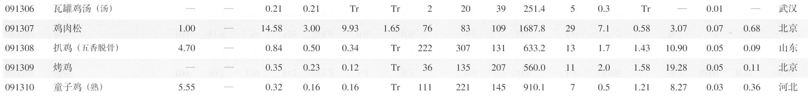
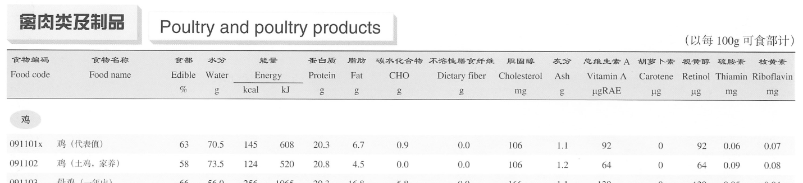

# 说明

此处的测试数据，主要为了[Sanotsu/free-fitness](https://github.com/Sanotsu/free-fitness) 项目的食物导入功能的测试。

---

2025-07-24 添加了 [食物升糖指数（GI）截图](./食物升糖指数（GI）截图) 和 [食物 GI 指数 json 文件](json_gi_of_foods/glycemic_index_of_foods.json) (这个数据量少，有手动检查过)。

---

将 pdf 版本的[《中国食物成分表标准版（第 6 版）》](https://www.pumpedu.com/home-shop/5514.html) 中“能量和食物一般营养成分”部分进行截图，通过 python 脚本构建为指定格式的 json 文件。

- 2025-07-23 第二版 `index_vision_llm_processor.py`:
  - 先调用视觉理解大模型 API(需要自行在`.env`配置)，将图片识别为 markdown 表格格式，再构建为 json 文件
    - 具体使用方法参看 [README_index_vision_llm_processor](README_index_vision_llm_processor.md)
  - 数据在 [json_data_vision](./json_data_vision) 文件夹
    - 这个数据是使用阿里百炼平台的`通义千问2.5-VL-72B`模式识别的
    - 效果比`通义千问VL-Plus`、`GLM-4.1V-9B-Thinking`好得多
    - 可以自行使用更高级的视觉大模型来识别，视觉推理模型应该非常耗时，但效果不确定
- 第一版 `index.py`:
  - 先通过[飞桨 OCR](https://github.com/PaddlePaddle/PaddleOCR) 转为 exel 文件，再构建为 json 文件
  - 数据在 [json_data](./json_data) 文件夹

---

## 脚本说明

将截图通过飞桨 OCR 转为 exel 文件(第一版 `index.py`)，或调用视觉大模型 API 识别为 markdown 表格代码(第二版`index_vision_llm_processor.py`)，并进一步构建成指定格式的 json 文件。

即多张同类食物"能量"部分和"一般营养成分"部分的截图，如：

`禽肉类及其制品-鸡1-energy.png`:


`禽肉类及其制品-鸡1-nutrient.png`:


`禽肉类及其制品-鸡2-energy.png`:


`禽肉类及其制品-鸡2-nutrient.png`:


转换为单个`merged-禽肉类及其制品-鸡.json`文件

```json
[
  {
    "foodCode": "091101x",
    "foodName": "鸡 (代表值)",
    "edible": "63",
    "water": "70.5",
    "energyKCal": "145",
    "energyKJ": "608",
    "protein": "20.3",
    "fat": "6.7",
    "CHO": "0.9",
    "dietaryFiber": "0.0",
    "cholesterol": "106",
    "ash": "1.1",
    "vitaminA": "92",
    "carotene": "0",
    "retinol": "92",
    "thiamin": "0.06",
    "riboflavin": "0.07",
    "niacin": "7.54",
    "vitaminC": "Tr",
    "vitaminETotal": "1.34",
    "vitaminE1": "1.34",
    "vitaminE2": "0.37",
    "vitaminE3": "0.10",
    "Ca": "13",
    "P": "166",
    "K": "249",
    "Na": "62.8",
    "Mg": "22",
    "Fe": "1.8",
    "Zn": "1.46",
    "Se": "11.92",
    "Cu": "0.09",
    "Mn": "0.05",
    "remark": ""
  },
    ……
]
```

## 各个栏位中文名称

energy 部分栏位中文名称:



nutrient 部分栏位中文名称:


## 运行

**飞桨 OCR 模式**：

```sh
python3 index.py
```

测试执行转换花费了两个多小时，所以有需要直接使用`json_data`文件夹中的 json 文件即可；也可以按照个人需求修改脚本，自定义输出内容。

```sh
# 在 i5-4460 CPU 和 GT710 独显下 Windows7 系统中使用 VBox7 装的 Ubuntu22 虚拟机中的测试结果
截图ocr总耗时: 9119.207285642624秒
```

**视觉大模型 API 模式**(本人更推荐这种方式，配合好的视觉大模型效果更佳)：

```sh
python3 index_vision_llm_processor.py
```

有需要也可以直接使用`json_data_vision`文件夹中的 json 文件即可。

- 具体使用方法参看 [README_index_vision_llm_processor](README_index_vision_llm_processor.md)

## 注意事项

**【注意】**: 不保证数据 OCR 识别的绝对一致；所有版权都归原作者所有，有任何必要的话请通知我删除此仓库。
