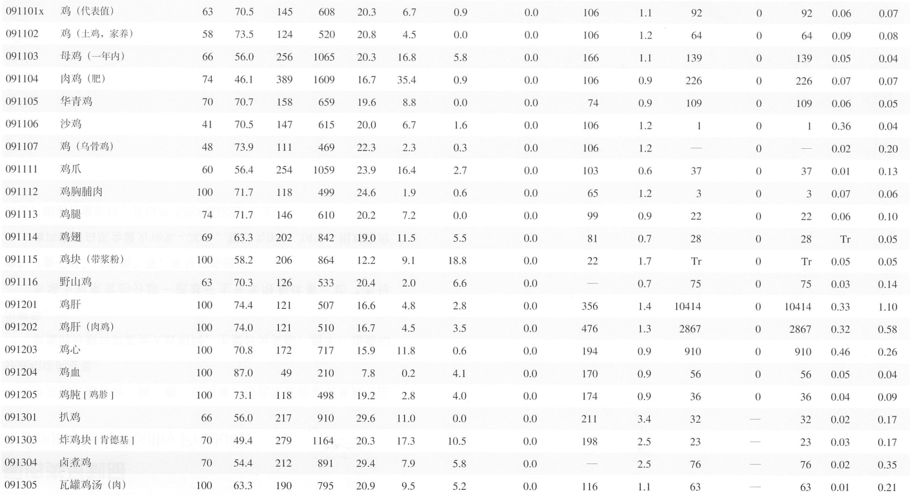

# 说明

此处的测试数据，主要为了[Sanotsu/free-fitness](https://github.com/Sanotsu/free-fitness) 项目的食物导入功能的测试。

## 脚本说明

将 pdf 版本的[《中国食物成分表标准版（第 6 版）》](https://www.pumpedu.com/home-shop/5514.html) 中“能量和食物一般营养成分”部分进行截图，并通过飞桨 OCR 转为 exel 文件，并进一步构建成指定格式的 json 文件。

即多张同类食物能量和营养素的截图：




转换为单个`merged-禽肉类及其制品-鸡.json`文件

```json
[
  {
    "foodCode": "091101x",
    "foodName": "鸡 (代表值)",
    "edible": "63",
    "water": "70.5",
    "energyKCal": "145",
    "energyKJ": "608",
    "protein": "20.3",
    "fat": "6.7",
    "CHO": "0.9",
    "dietaryFiber": "0.0",
    "cholesterol": "106",
    "ash": "1.1",
    "vitaminA": "92",
    "carotene": "0",
    "retinol": "92",
    "thiamin": "0.06",
    "riboflavin": "0.07",
    "niacin": "7.54",
    "vitaminC": "Tr",
    "vitaminETotal": "1.34",
    "vitaminE1": "1.34",
    "vitaminE2": "0.37",
    "vitaminE3": "0.10",
    "Ca": "13",
    "P": "166",
    "K": "249",
    "Na": "62.8",
    "Mg": "22",
    "Fe": "1.8",
    "Zn": "1.46",
    "Se": "11.92",
    "Cu": "0.09",
    "Mn": "0.05",
    "remark": ""
  },
    ……
]
```

## run

```
python3 index.py
```

测试执行转换花费了两个多小时，所以有需要直接使用`json_data`文件夹中的 json 文件即可；也可以按照个人需求修改脚本，自定义输出内容。

```sh
截图ocr总耗时: 9119.207285642624秒
```

## Note

**【注意】**: 不保证数据 OCR 识别的绝对一致；所有版权都归原作者所有，有任何必要的话请通知我删除此仓库。
